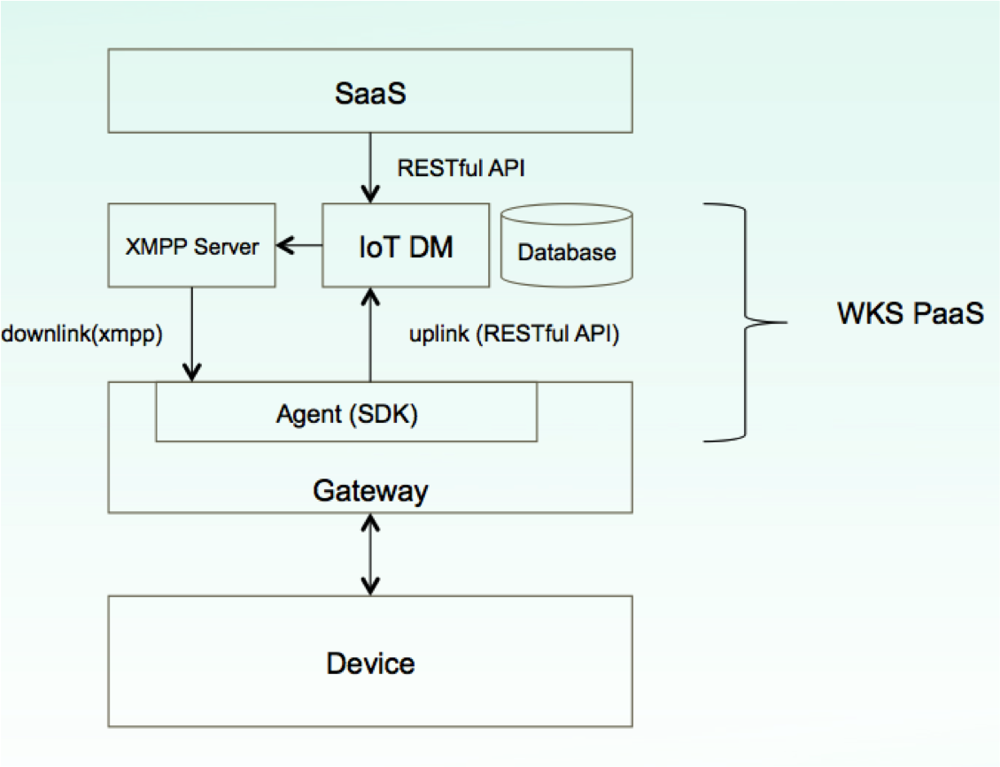

# RX agent SDK

## Introduction

The SDK is for gateway vendor to implement a agent on Gateway. Using this SDK, gateway vendor can have uplink and downlink with WKS IoT DM. For the context of uplink and downlink, it's not in the document. It should be discussed between SaaS and Gateway.


## files

### sdk library / header file
- ./lib/librx.a
- ./inc/rxagent.h

### example code
- ./examples/main.c
- ./examples/Makefile

### document
- ./html/

## dependent libraries
- XMPP Client: libstrophe
	- 	libstrophe.so
- Openssl
	- libssl.so
	- libcrypto.so	
- XML Parser: expat
	- libexpat.so
- HTTP Client: curl
	- libcurl.so	


## Run example

1. install Ubuntu 16.04.3

2. install dependent libraries, ssl expat curl

3. download project from [https://github.com/strophe/libstrophe](https://github.com/strophe/libstrophe) and build libstrophe.so

4. check host ip, port in main.c. Use telnet to check if the service is available.

5. cd sdk-rx/examples; make

6. Run example ```./rxtest```
